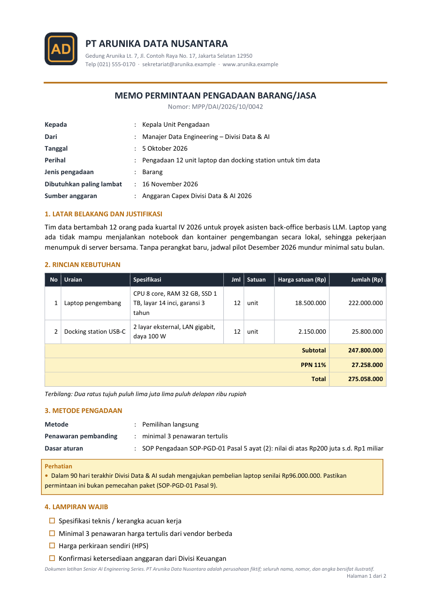

# Template Dokumen Back-office — Senior AI Engineering Series · Pertemuan 6

Bahan lab **Pertemuan 6: Skill Creators** (rubythalib.ai). Enam template surat/dokumen kantor `.docx`
untuk perusahaan fiktif **PT Arunika Data Nusantara**, dirancang untuk dipakai agent dengan **LLM kecil (4B–14B)**:

- **LLM tidak menulis dokumen dan tidak menulis kode dokumen.** LLM hanya mengisi *field* lewat **function calling**
  (argumen JSON yang divalidasi skema).
- **Layout dikunci di template** (kop, tabel, tanda tangan, penomoran halaman); program merender dengan
  [docxtpl](https://docxtpl.readthedocs.io).
- **Nilai yang ditentukan SOP atau aritmetika diisi program**, bukan LLM: nomor dokumen, tanggal surat, subtotal,
  PPN, terbilang, metode pengadaan, rantai persetujuan, tarif perjalanan, severity insiden.

| Template | Dipakai untuk | Fungsi tool |
|---|---|---|
| `memo_pengadaan` | Memo permintaan pengadaan barang/jasa (kita membeli) | `isi_memo_pengadaan` |
| `sppd` | Surat perintah perjalanan dinas + rincian biaya | `isi_sppd` |
| `nota_dinas` | Surat resmi internal antar-unit | `isi_nota_dinas` |
| `notulen_rapat` | Notulen rapat dari catatan/transkrip | `isi_notulen_rapat` |
| `laporan_insiden` | Laporan insiden layanan TI | `isi_laporan_insiden` |
| `surat_penawaran` | Surat penawaran harga ke klien (kita menjual) | `isi_surat_penawaran` |

Pratinjau hasil render ada di [`pratinjau/`](pratinjau/) dan contoh berkasnya di [`contoh/hasil/`](contoh/hasil/).



## Isi repo

```
templates/<nama>.docx     template docxtpl (Jinja di dalam Word)
skema/<nama>.json         {"tool": definisi function calling (field LLM), "field_program": field yang diisi program}
contoh/<nama>.json        {"llm": argumen contoh dari LLM, "program": field program contoh}
contoh/hasil/             hasil render contoh (.docx dan .pdf)
render.py                 tools(), validasi(), render(), rupiah(), terbilang_rupiah(), tanggal_id()
sumber/                   kode pembangun template, skema, dan contoh (reproducible)
```

## Pakai di Google Colab

```python
!wget -q https://github.com/rubythalib33/senior-ai-p6-template-dokumen/archive/refs/tags/v1.0.zip -O tpl.zip
!unzip -q -o tpl.zip && mv senior-ai-p6-template-dokumen-1.0 template_dokumen
!pip install -q docxtpl jsonschema
import sys; sys.path.insert(0, "template_dokumen")
from render import tools, validasi, render, rupiah, terbilang_rupiah, tanggal_id
```

Atau ambil satu berkas saja:

```bash
wget -q https://raw.githubusercontent.com/rubythalib33/senior-ai-p6-template-dokumen/v1.0/templates/memo_pengadaan.docx
```

## Alur function calling (vLLM / API kompatibel OpenAI)

```python
import json
from openai import OpenAI
klien = OpenAI(base_url="http://127.0.0.1:8000/v1", api_key="lab")

r = klien.chat.completions.create(
    model="qwen",
    messages=[{"role": "user", "content": "Saya Dimas, Manajer Data Engineering. Mau beli 12 laptop ..."}],
    tools=tools(["memo_pengadaan"]),
    tool_choice={"type": "function", "function": {"name": "isi_memo_pengadaan"}},
)
argumen = json.loads(r.choices[0].message.tool_calls[0].function.arguments)

galat = validasi("memo_pengadaan", argumen)      # [] bila lolos; bila tidak, kirim balik ke model sebagai umpan balik
program = hitung_field_program(argumen)            # milik skill: nomor, total, PPN, metode, persetujuan, ...
render("memo_pengadaan", {**argumen, **program}, "memo.docx")
```

`render()` menolak dengan pesan jelas bila ada field template yang belum diisi. `render(..., pdf=True)` juga membuat
PDF bila LibreOffice tersedia (`apt-get install -y libreoffice-writer-nogui`).

## Membangun ulang

```bash
pip install python-docx docxtpl jsonschema pillow
python sumber/bangun_template.py    # templates/*.docx
python sumber/buat_skema.py         # skema/*.json
python sumber/buat_contoh.py        # contoh/*.json + contoh/hasil/*.docx  (tambahkan --pratinjau di Windows + Word)
```

## Catatan

- PT Arunika Data Nusantara adalah perusahaan fiktif. Semua nama, alamat, nomor, dan angka di contoh bersifat ilustratif,
  termasuk ambang pengadaan dan tarif perjalanan; aturan SOP lengkapnya ditulis sebagai *skill* di notebook Pertemuan 6.
- Lisensi: MIT (lihat `LICENSE`).
